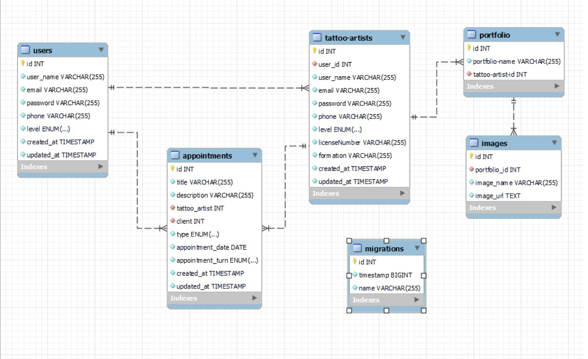

<h1 align="center"> BACKEND PARA MATASUEGRAS TATTOO</h1>
​
​

Proyecto 4 - Bakend para tattoo shop- Semana 5-6

​

Proyecto de creacion de una api rest para un estudio de tatuajes por Pascual Fernandez.
 
Desarrollada como formacion del Bootcamp de Full Stack Developer de Geekshubs Academy.

​
​

​
​
<h5 align="center"> Tecnologías utilizadas</h1>
​

TypoScript, node, express, typeOrm, openAI, git/github y Postman/ThunderClient

  <tr >
    <td valign="top"></td>
    <td valign="top"></td>
    <td valign="top"></td>
    <td></td>
     <td valign="top"></td>
    <td valign="top"></td>
    <td valign="top"></td>
    <td valign="top"></td>

​

## Tabla de contenidos

​

- [👩🏻‍💻 Descripción del proyecto]
- [🔍 Observaciones]
- [⚖️ Licencia y Copyright]

  ​
  ​

### Descripción

​
Tercer proyecto creado durante la semana 5 y 6 del bootcamp. Creacion de un backend y una API REST para un estudio de tatuajes, centrado en aprender a manejar tablas, migraciones, endpoints...

## Esquema de la BBDD:

## Como utilizar la appi:

**Instalar node**  
**instalar express**  
**instalar typeORM**  
**instalar postman o la extension de VSCODE Thunderclient**  

ejecutar el comando **npm run dev** en el terminal

Lo primero crear un usuario y hardcodearlo en la BBDD directamnte con el level **black_alien**.

Esto nos permitira en un futuro poder dar permisos de tatuador a otros usuarios que se registren, ya que no vamos a permitir registrarse como tatuador a nadie.

el email de los usuarios siempre va a ser **nombre@nombre.com**
la contraseña siempre es el **nombre**
el secreto para encriptar es **matasuegras**
##### Endpoints:
###### Endpoints para user:

localhost:4000/user
>/register TIPO: **POST** : crear usuarios
>>AUTH: nada  
>>BODY
>>>{  
"user_name":"your name",  
"email":"your email",  
"password":"your password",  
"phone":"your phone"  
}  

>/login TIPO: **POST**: logear usuarios
>>AUTH: nada  
>>BODY
>>>{  
“Email”:”your email”  
“Password:”your password”  
}

>/profile TIPO: **GET**: obtener tu perfil de usuario
>>AUTH: token tipo bearer obtenido al hacer el login  
>>BODY: nada  

>/update TIPO: **PUT**: modificar usuarios
>>AUTH: token tipo bearer obtenido al hacer el login  
>>BODY  
>>>En el body es opcional cual campo cambiar  
{  
"user_name":"your name",  
"email":"your mail",  
"password":"your password",  
"phone":"your phone"  
}

>/myAppointments TIPO: **GET**: ver tus citas como usuario
>>AUTH: token tipo bearer obtenido al hacer el login  
>>BODY  
>>>{  
“id": your id  
}

###### Endpoints para appointments:

localhost:4000/appointment
>/create TIPO: **POST** : crear citas
>>AUTH: token tipo bearer obtenido al hacer el login  
>>BODY  
>>>{    
 "title":"your title",  
 "description":"your description",  
 "tattoo_artist": tattoo_artist id  
 "client":user id,  
 "type":ENUM “tattoo” or “piercing”  
 "date":"YYYY/MM/DD",  
 "turn":ENUM “morning” or “evening”  
}  

>/update TIPO: **PUT** : actualizar citas
>>AUTH: token tipo bearer obtenido al hacer el login  
>>BODY  
>>>{    
"id": appointment_id  
"title":"your title",  
"description":"your description",  
"tattoo_artist": tattoo_artist id  
"client":user id,  
"type":ENUM “tattoo” or “piercing”  
"date":"YYYY/MM/DD",  
"turn":ENUM “morning” or “evening”  
}  

>/delete TIPO: **DELETE** : eliminar citas  
>>AUTH: token tipo bearer obtenido al hacer el login  
>>BODY  
>>>{  
“Id”:appointment_id  
}

###### Endpoints para tattoo_artist:

localhost:4000/tatto_artist
>/register TIPO: **POST** : convertir un usuario en tatuador  
>>AUTH: token tipo bearer obtenido al hacer el login (solo sirve el de black_alien)  
>>BODY  
>>>{  
"user_id":6,  
"user_name":"DonRogelio",  
"email":"donrogelio@donrogelio.com",  
"password":"donrogelio",  
"phone":"666666666",  
"licenseNumber":"666",  
"formation": "curso de jeringas..."  
}  

>/myAppointments TIPO: **GET** : ver tus citas como tatuador  
>>AUTH: token tipo bearer obtenido al hacer el login (solo sirve el de level tattoo o black_alien)  
>>BODY  
>>>{
"Id":id del tatuador como usuario (columna 2)  
"Tattoo_artist_id":id del tatuador (columna 1)  
}
###### Endpoints para el black_alien (superadmin):  
>/tattoArtists TIPO: **GET** : Ver el listado de todos los usuarios de la pagina  
>>AUTH: token tipo bearer obtenido al hacer el login (solo sirve el de black_alien)  
>>BODY: nada  

>/changelevel TIPO: **PUT** : Cambiar el nivel de un usuario  
>>AUTH: token tipo bearer obtenido al hacer el login (solo sirve el de black_alien)  
>>BODY:  
>>>{  
  "id":id del usuario,  
  "level":ENUM "user, tattoo, admin, black_alien"  
}

>/deleteuser TIPO: **DELETE** : Eliminar un usuario  
>>AUTH: token tipo bearer obtenido al hacer el login (solo sirve el de black_alien)  
>>BODY: nada  
>>>{  
  "id":id del usuario,  
}

###### Endpoints publicos:
localhost:4000/public  
>/tattoArtists TIPO: **GET** : Ver el listado de tatuadores  
>>AUTH: nada  
>>BODY: nada  

>/getImagesTIPO: **GET** : Ver el listado de tatuajes  
>>AUTH: nada  
>>BODY: nada  

### Cambios pendientes

- ��A dia de hoy valida la ficha al crearla, pero tengo que mejorar la funcion para que tambienla valide al actualizar
- ��Añadir algun endpoint mas como por ejemplo ver la galeria para todos los usuarios
- ��Valorar si al crear un tatuador borrarlo de la tabla de usuarios

### Agradecimientos

A toda esos heroes anonimos que suben trocitos de codigo a internet y hace la vida mucho mas facil a los estudintes.
​
​

### Licencia y copyright

📝 La licencia utilizada es una MIT License.
Este proyecto ha sido realizado pixel a pixel por mi, Pascual Fernandez, para completar la sexta semana del BootCamp Full Stack de GeeksHubs Academy Valencia.
